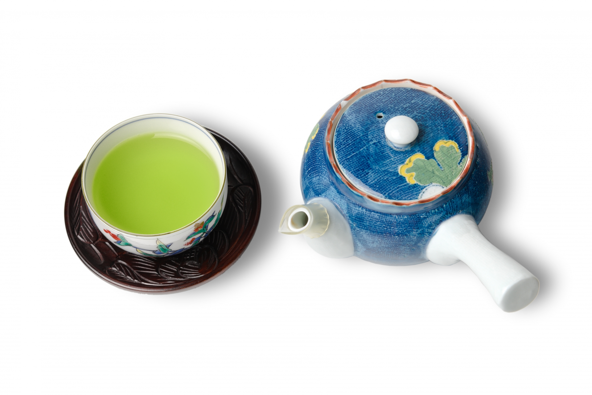

こんにちは。今回は、緑茶と健康について紹介したいと思います。

結論、緑茶は、

- 毎日数杯飲むと、死亡リスクが下がり、認知機能の低下を防ぐことができる
- またカフェインやテアニンを摂取でき、集中力を上げることができる。

といった効果が考えられます。

今回は、緑茶に関する健康的な効果について、論文をもとに解説していきたいと思います。

## 日本人を対象に行った緑茶の健康効果に関するの論文

[国立がん研究センターが1990年～2011年まで行った日本人約９万人を対象に行ったコホート研究](https://epi.ncc.go.jp/jphc/outcome/3526.html)では、被験者に対して緑茶を飲む頻度と死亡リスクの関連を調べました。

その結果が以下のようになりました。

- **緑茶を毎日1杯未満しか飲まない人と比べて、男性で毎日3～4杯程度飲む人は死亡リスクが12％減少し、毎日5杯以上飲む人は死亡リスクが13％減少した。**

- **また、女性で緑茶を毎日3～4杯程度飲む人は死亡リスクが13％減少して、毎日5杯以上飲む人は17％減少した。**

上記の事からも、男女ともに緑茶を飲めば飲むほど、死亡リスクが減少することが分かりました。

また、緑茶と各疾患における死亡リスクについて調べたところ以下のようになりました。

- 緑茶を毎日1杯未満しか飲まない人と比べて、毎日3～4杯飲む人は心疾患の死亡リスクが26％減少した。また毎日5杯以上飲む女性は、心疾患の死亡リスクが37％減少した。

- また、男性の呼吸器疾患（肺炎、風邪、肺がん等）の死亡リスクは、毎日3～4杯飲む人は28％減少して、毎日5杯以上飲む人は45％減少した。

- また、男性の脳血管疾患（脳梗塞、脳出血など）の死亡リスクは、毎日3～4杯飲む人は29％減少して、毎日5杯以上飲む人は24％減少した。

上記の事からも、緑茶を飲むと、とくに男性は呼吸器や脳の疾患での死亡リスクが低くなり、女性は心疾患での死亡リスクが低くなるいった特徴があります。

また各疾患の死亡リスクを見ると、3～4杯飲む人よりも毎日5杯以上飲む人の方が、死亡リスクの減少度合いが小さくなっているので、3～4杯もしくは、5杯程度がちょうどいい緑茶の摂取量と言えるかもしれません。

## なぜ、緑茶が死亡リスクを下げるのか？

先ほどの研究でも、緑茶をより多く飲む人ほど死亡リスクが低いことが分かりました。

ここで緑茶を飲むことが死亡リスクを下げる要因としては、以下のことが考えられます。

- **緑茶に含まれるカテキンは、血圧や体脂肪、脂質を調節する効果があり、血糖値改善に役立つ。**

- **また緑茶に含まれるカフェインが、気管支拡張作用を促し、呼吸器機能の改善効果に役立つ。** ここで、気管支拡張作用とは気管支を広げることで空気の流れを良くし、呼吸困難を軽減する作用のことです。

- **また、緑茶に含まれるテアニンやカフェインには、認知能力や注意力の改善に効果があると考えれている。**

上記の事から、緑茶を飲むことでカテキンとカフェインを摂取することができ、血流や肺、脳機能を改善し、循環器疾患や呼吸器疾患、脳疾患などの疾患を抑えることができることが、死亡リスクの低下につながっていると考えられます。

## 緑茶の一日の摂取量は何グラムか？

先ほどの研究でも毎日緑茶を3～4杯、または5杯以上飲む人は、死亡リスクが低いことが分かりました。

緑茶の摂取方法としては、茶葉と粉末抹茶が考えられます。

- 茶葉の場合は、[一杯3～5g](http://www.takanashi-chaen.com/irekata.php#:~:text=%E5%90%88%E3%81%A3%E3%81%9F-,%E8%8C%B6%E8%91%89%E3%81%AE%E9%87%8F,-%E3%80%81%E6%B9%AF%E3%81%AE%E9%87%8F)が適量です。なので毎日5杯飲むとすると、15～25gを目安にして、飲むと良いでしょう。

- また、粉末抹茶の場合は、急須に入れて飲む茶葉と比べて、直接飲むことができるため、摂取量は茶葉よりも少なくなります。[一杯に0.25g～0.5g](https://iiocha.com/hunmatu3set.htm#:~:text=%E5%A4%89%E3%82%8F%E3%82%8A%E3%81%BE%E3%81%99%E3%81%8C%E3%80%81-,%E5%A4%A7%E4%BD%930.25%EF%BD%87%E3%81%8B%E3%82%890.5%EF%BD%87%E3%81%8F%E3%82%89%E3%81%84,-%E3%80%82%E7%9B%AE%E5%AE%89%E3%81%A8%E3%81%97%E3%81%A6%E3%81%AF)ほどが適切であるので、5杯分程度飲むとなると、一日に1g～2.5g程度の粉末抹茶を飲むと良いでしょう。

以前から、私は[粉末の緑茶・抹茶](https://www.amazon.co.jp/%E3%81%8A%E8%8C%B6%E3%81%AE%E4%B8%B8%E5%B9%B8-%E5%AE%87%E6%B2%BB%E6%8A%B9%E8%8C%B6%E5%85%A5%E3%82%8A%E7%B2%89%E6%9C%AB%E7%B7%91%E8%8C%B6-70g%C3%975%E8%A2%8B/dp/B0B8BQS3L9/ref=asc_df_B0B8BQS3L9/?tag=jpgo-22&linkCode=df0&hvadid=707549646638&hvpos=&hvnetw=g&hvrand=13922819576106809526&hvpone=&hvptwo=&hvqmt=&hvdev=c&hvdvcmdl=&hvlocint=&hvlocphy=1009180&hvtargid=pla-1828387284183&psc=1&mcid=59e2e2076e8a3db6a37d7963281732d9&th=1&psc=1&gad_source=1)を使っていて、一パック70gを1か月で使っていて、一日の摂取量が約2.3g程度だったので、ちょうどいいかなと思いました。

とくに、粉末緑茶はお湯や水に溶かすだけで、すぐに飲めるので、忙しい社会人の方にはおすすめです。

## 緑茶の健康効果まとめ

今回は、緑茶と健康に関する効果を紹介しました。

緑茶の効果をまとめると、

- **緑茶を毎日1杯未満しか飲まない人と比べて、毎日3以上飲む人は、死亡リスクが12％～20％下がる**

- **緑茶を毎日3杯以上飲むと、とくに男性は呼吸器や脳の疾患での死亡リスクが低くなり、女性は心疾患での死亡リスクが低くなる**

とのことでした。**また、緑茶を一日5杯以上飲むと、各疾患に対する健康的な効果が薄れる場合があったので、おおむね一日に3～5杯を目安に飲むと良いでしょう。**

## 終わりに

茶道の精神では、よく「わび・さび」という言葉が使われます。

「わび」とは、気落ちするという意味であり、「さび」とは、古くなる・色あせるなどの意味で使われます。そして、「わび・さび」とは、「思うことが叶わずに、思いわずらう」という否定的な言葉なのです。

しかし、室町時代あたりから[「わび・さび」は、失意や窮乏（金銭が著しく不足して苦しい様子）などの自分の思い通りにならない状態をうけいれ、積極的に落ち着いて暮らそうという肯定的な意味で使われるようになりました。(参考:和楽Web)](https://intojapanwaraku.com/rock/culture-rock/13279/)

**緑茶を飲むときも、ただ健康のためを思って飲むのではなく「わび・さび」を意識して、自分の思うことが行かないはかなさを感じながらも、ゆっくりと落ち着いた時間を楽しむようにしましょう！**

以上、アンチエイジングの研究を紹介しました。
みなさん、ぜひ健康に気をつけて長く生きましょう！では、また来週にお会いしましょう！

  {{ $data.Title }}>

