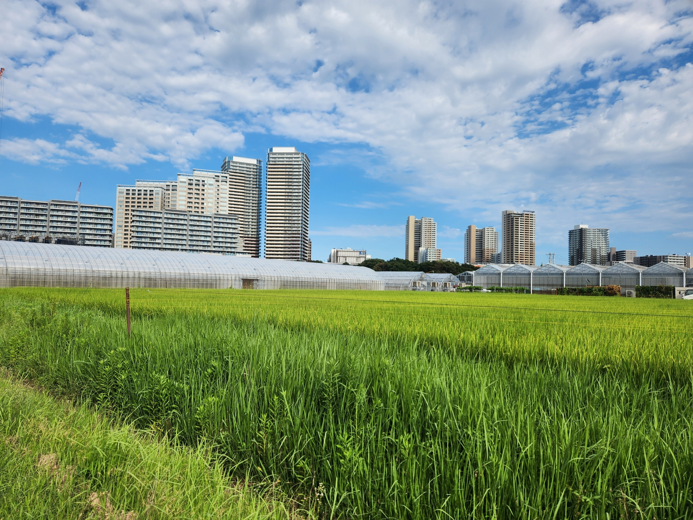

こんにちは。

今回は、都会と田舎でどちらが健康暮らせるかを研究論文を元に紹介したいと思います。

この記事は以下のような人におすすめです。

- 今から、就職や転職をしようと考えているけど、都会に行こうか、田舎に行こうか迷っている人

- 健康的な面について、都会・田舎のデメリット・メリットを知って、今後の移住地を決めたい人

## メンタルヘルスに良いのは田舎

以前書いた「健康的なリスクで最も危険な「孤独」にならないための対策1 〜自然〜」でも紹介しましたが、

- 人混みが多い場所ほど、一時的な孤独感が上がる
- 自然に触れるほど、一時的な孤独感が下がる

といったことが研究で分かっています。

このことからも、人口密度が高い場所では孤独感を感じやすく、田舎（自然の多い場所）では孤独感を感じずらいです。とくに、孤独は、死亡リスクを高めたり、うつ病、認知症のリスクを高め、健康上のリスクの中でも危険な要素であるため、避けたいところです。

ですので、メンタルヘルスの観点からは、田舎の自然にアクセスが良く、人混みが少ない場所に住むと、孤独感が減少して健康やメンタルヘルスに役立つと考えられます。

また、[2018年にスウェーデンの人を対象に行われた研究](https://www.cambridge.org/core/journals/the-british-journal-of-psychiatry/article/urbanisation-and-incidence-of-psychosis-and-depression/AF3FDF51E9DA192097BEF153D9A02148)では、住んでいる都市化の度合いと精神病の関連について調べました。

その結果、以下のようになりました。

- 人口密度が上位20％に住む女性は、人口密度が下位20％の女性に比べて、精神病の発症率が166％高かった。また、うつ病を発症するリスクが43％高かった。

- また、人口密度が上位20％に住む男性は、人口密度が下位20％の男性に比べて、精神病の発症率が68％％高かった。また、うつ病を発症するリスクが12％高かった。

- 最も都市化された地域に住む男性は、最も都市化されていない地域に住む男性よりも精神病になる確率が125％高く、うつ病になる確率が27％高かった。

上記の事から、人口密度がより高い都市に住むと精神病やうつ病になりやすいことが分かります。

総じて、都会に住むほど孤独感を感じやすく、またうつ病のリスクが高まることが分かりました。

## 日本の市町村では田舎・都会は健康に関係ない

先ほどの研究例では、都会よりも田舎の方がうつ病になりにくく、メンタルヘルスに良いということが分かりました。

そのように考えると、都会の人ほど不健康で、田舎の市町村に住む人は精神的に安定していて、健康的であると考えられます。

しかし、実際のところは日本では、田舎・都会で健康的であるかどうかは関係なくなっています。

以下は2024年の男性の平均寿命が長い市町村の上位5つです。

| 順位 | 市町村 | 平均年齢 |
| --- | --- | --- |
| 1位 | 神奈川県川崎市麻生区 | 84.0歳 |
| 2位 | 神奈川県横浜市青葉区 | 83.9歳 |
| 3位 | 長野県上伊那郡宮田村 | 83.4歳 |
| 4位 | 愛知県日進市 | 83.4歳 |
| 5位 | 京都府木津川市 | 83.3歳 |

上記のように、人口密度の多い神奈川県の川崎市や横浜市が上位を占めていますし、また田舎である長野県上伊那郡宮田村の人も長生きしていることが分かります。このことからも、田舎ほど健康的とは一概に言えないことが分かります。

また、以下が男性の平均寿命の下位5つの市町村です。

| 順位 | 市町村 | 平均年齢 |
| --- | --- | --- |
| 1位 | 大阪府大阪市西成区 | 73.2歳 |
| 2位 | 大阪府大阪市浪速区 | 77.9歳 |
| 3位 | 大阪府大阪市生野区 | 78.0歳 |
| 4位 | 青森県下北郡東通村 | 78.1歳 |
| 5位 | 青森県上北郡六ヶ所村 | 78.3歳 |

参考:[男女とも平均寿命の長い市区町村は？_メディカルプライム新川](https://medicalprime-shinkawa.com/column/767)

平均寿命の下位のランキングを見ても、都会である大阪府の区が上位を占めていて、都会ほど不健康であるかと思いきや、青森県の市町村が含まれており、都会ほど不健康で田舎ほど健康とは言えない状況となっています。

このことからも、日本では田舎・都会で健康的であるかどうかは関係なくなっていることが分かります。

## なぜ、日本では田舎と都会において健康的な差がでないのか？

先ほど紹介した研究では田舎の方がメンタルヘルスに影響が良いことが分かりました。そこで田舎の方が健康的であると思いきや、平均寿命が長い市町村のランキングでは、田舎や都会であることと健康が関係していないことが分かりました。

田舎と都会において健康的な差がでない理由としては、以下のことがあげられます。

- メンタルヘルスに関しては田舎の方が充実しているが、都会の方が医療や社会的なサービスが充実しているため、病気になった時の対処が早い。
- [高齢者になっても、就業率が高いかどうかが健康寿命を決めている。](65歳以上の高齢者の就業率が高く、役割や責任をもって生活していること)
- [都会田舎に関係なく、自然へのアクセスが良いか、騒音や大気汚染が少ないかどうか、住宅環境が良いかどうかという面が健康やメンタルヘルスに関連している。](https://journals.sagepub.com/doi/abs/10.1177/0020764017744582?journalCode=ispa)そのため、田舎か都会かどうかは関係なく、身近な場所や住む家によって健康かどうかが決まる。
- 周りの人が健康意識が高いかどうか（食生活や運動習慣などが関わる）

上記のように田舎か都会かどうかによらず、様々な要因が健康に関わってくるかと思います。

## まとめ

今回は、都会と田舎でどちらが健康暮らせるかを紹介しました。

結論的には、田舎・都会で健康に暮らせるかどうかは関係ないことが分かりました。

しかし、研究論文の結果としては、

- 人口密度の低い場所よりも人口密度の高い場所の方が孤独感を感じやすい。
- 都会では、田舎よりも精神病が発症率が２倍近く高くなる。

といったことが分かりました。ですので、住居選びの際は都会か田舎の市町村かどうかによらず

- なるべく、人口密度の低い場所を選ぶ
- 自然へのアクセスが近い場所を選ぶ

といったことを意識すると良いかと思います。

ただ、環境よりも個人的な意識が健康に大きく影響してくる影響してくると思うので、自然へのアクセスを積極的に増やしたり、新鮮な魚や野菜をたくさん食べたり、近くのジムや施設をつかったりして運動をしたりすることが大事かなと思います。

以上、アンチエイジングの研究を紹介しました。
みなさん、ぜひ健康に気をつけて長く生きましょう！では、また来週にお会いしましょう！

  {{ $data.Title }}>

