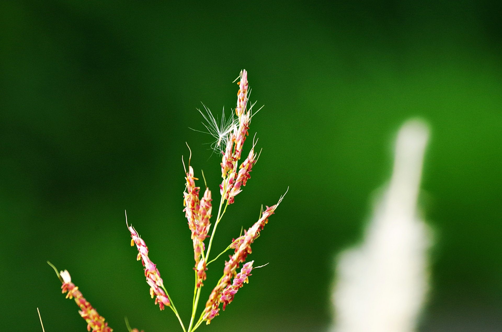
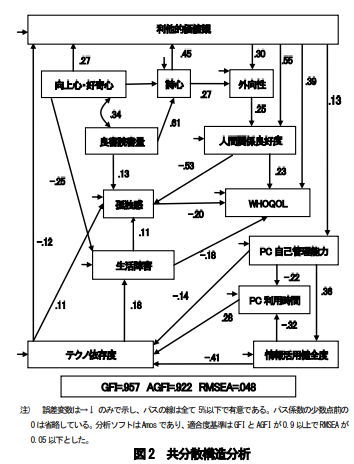
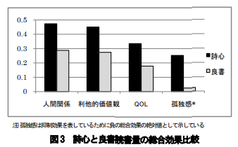

こんにちは。今回は、以前にも書いた孤独対策に関する記事の第3弾です。以下が関連する記事となります。

- 孤独感が健康に及ぼす影響について　まとめ

- 健康的なリスクで最も危険な「孤独」にならないための対策1 〜自然〜

- 健康的なリスクで最も危険な「孤独」にならないための対策2 〜感謝〜

今回紹介する孤独の対策としては、詩心を持つことです。

[「詩心」とは、詩を理解し、愛し、また詩を生み出す心](https://kazahanamirai.com/shigokoro7.html#:~:text=%E8%A9%A9%E5%BF%83%E3%80%8D%E3%81%AF-,%E8%A9%A9%E3%82%92%E7%90%86%E8%A7%A3%E3%81%97%E3%80%81%E6%84%9B%E3%81%97%E3%80%81%E3%81%BE%E3%81%9F%E8%A9%A9%E3%82%92%E7%94%9F%E3%81%BF%E5%87%BA%E3%81%99%E5%BF%83,-%E3%81%A7%E3%81%82%E3%82%8A%E3%81%BE%E3%81%99)のことです。

詩心や詩に関しては、「意味があいまいで分かりにくい」「古臭くて、興味がない」といったように関心を持たない人も多いのではないのでしょうか？

実際に、私も詩に関しては、生活にとって全く意味のないものと考えて、興味を持っていなかったのですよね。（笑）

しかし、研究では詩心を持つ人は以下のような特徴を持ちます。

- 外向性が高くなる
- 高い感受性を持ち、共感性や協調性が高くなる
- 人間関係が良好になる

また上記の特徴によって、詩心を持つは孤独になりにくいことが分かっています。

今回は、健康において最も危険な「孤独」と「詩心」についての研究を紹介していきたいと思います。

## 日本で行われた「詩心」と「孤独感」に関する研究

[2009年に創価大学によって行われた情報系の大学生285人を対象にした研究]()では、詩心とQOLやテクノ依存症([コンピューターやスマートフォンなどの情報機器に没頭してしまい、それがないと身体や精神に症状が出る状態](https://www.aemk.or.jp/word/ta24.html#:~:text=%E3%82%B3%E3%83%B3%E3%83%94%E3%83%A5%E3%83%BC%E3%82%BF%E3%82%84%E3%82%B9%E3%83%9E%E3%83%BC%E3%83%88%E3%83%95%E3%82%A9%E3%83%B3%E3%82%92%E3%81%AF%E3%81%98%E3%82%81%E3%81%A8%E3%81%97%E3%81%9F%E6%83%85%E5%A0%B1%E6%A9%9F%E5%99%A8%E3%81%AB%E6%B2%A1%E9%A0%AD%E3%81%97%E3%81%A6%E3%81%97%E3%81%BE%E3%81%84%E3%80%81%E3%81%9D%E3%82%8C%E3%81%8C%E7%84%A1%E3%81%91%E3%82%8C%E3%81%B0%E4%BD%93%E3%82%84%E7%B2%BE%E7%A5%9E%E3%81%AB%E7%97%87%E7%8A%B6%E3%81%8C%E5%87%BA%E3%82%8B%E7%8A%B6%E6%85%8B%E3%81%AE%E3%81%93%E3%81%A8))、人間関係等に関するアンケートを実施して、詩心が及ぼす生活満足度に関する影響を調査しました。

その結果以下のようになりました。

> 引用：[創価大学大学院工学研究科　情報化社会におけるテクノ依存症傾向への詩心の 抑制効果に関する研究](https://www.jstage.jst.go.jp/article/jasi/24/0/24_0_316/_pdf/-char/ja)

上記の図を解説すると以下のようになります。

- 詩心が高いほど、外向性が高い。
- 詩心が高いほど、利他的価値観（他人を大事にしたり、社会に役立つための意識）が高い。また、利他的価値観が高いほど、外向性が高く、また人間関係が良好である。

- また、人間関係の良好である人ほど、孤独感を感じにくい。

上記の結果からも、詩心が高い人ほど、外向性が高く、他人を大事にする気持ちを持つ人が多い事が分かります。また、人間関係が充実して孤独感を感じにくくなるということが分かりました。

つまり、**詩心を持つことが他人を気遣い、人と関わりたいという気持ちの部分に影響して、結果的に人間関係が良くなり、孤独感が減少するということが考えられます。**

そして、この研究では詩心を高める方法については以下が分かりました。

- 向上心や好奇心が高いほど、詩心を高める
- 良書の読書量が多いほど、詩心が高くなる。とくに、良書の読書は語彙力や表現力を高め、詩心を高めるために一番良い方である。

上記の事からも、詩心を高めるにはとくに良書を読み語彙力や表現力を鍛えることが重要だと分かりました。たしかに、良い詩を書いたり、理解するためには読書を通じて言葉の意味や使い方をたくさん知っておく必要がありそうですよね。

また、この研究では読書量と、詩心においてどちらが総合的に人間関係や利他的価値観、孤独感などにより良い影響しているかを調べました。

その結果が以下になっています。

> 引用：[創価大学大学院工学研究科　情報化社会におけるテクノ依存症傾向への詩心の 抑制効果に関する研究](https://www.jstage.jst.go.jp/article/jasi/24/0/24_0_316/_pdf/-char/ja)

上記のグラフは、詩心と良書読書量について、それぞれの各項目（人間関係、利他的価値観など）へ影響を考慮した際の各項目の結果となっています。

このグラフでは、ざっと詩心を持つ方が、良書読書量を増やすよりも、人間関係・利他的価値観・QOL・孤独感において、良い影響を与えていることが分かります。とくに、**孤独感に関しては詩心を持つ方が読書よりも、はるかに有効であることが分かります。**

上記の事から言えることとしては、

**孤独感を減らしたいなら、読書よりも詩心を書いたり、個人の詩を理解することを重視しよう！**

といった感じでしょうか。

ただし、読書量の多さは詩心の理解に役立つので、詩と読書で、半分半分くらいの割合で取り組むことがベストと言えるのではないでしょうか？

## 詩心を高く持つためには？

先ほど紹介した研究では、[創価大学の詩心に関する研究では](https://www.jstage.jst.go.jp/article/jasi/24/0/24_0_316/_pdf/-char/ja)詩心を構成する要素として、以下の４つ紹介されていました。

- 表現力（文章を書くことが好き、比喩表現をよく使う、自分の感情を言葉で表現する）
- 詩歌愛好度（短歌や俳句が好き、歌詞を理解する、本または小説が好き）
- 感受性（よく感動する方である、心に残っている言葉が多い、景色を楽しむ）
- 芸術性（芸術作品が好き、芸術に積極的に触れる、デザインにこだわる）

上記の４つで最も詩心を高める要素の順番としては、

表現力>芸術性>詩歌愛好度>感受性

というようになっていて、表現力が一番大事だということが分かりました。

ですので、

- 昔の詩人の言葉を学び、友達に話してみる
- 自分の感情を言葉で表現できるようにする
- 詩人が残した言葉を使って、文章を書いてみる。

といった芸術性を高めることに取り組んでみると良いと思います。

## まとめ

今回は、詩集と孤独について紹介しました。

まとめとしては、

- **詩心を持つことが他人を気遣い、人と関わりたいという気持ちの部分に影響して、結果的に人間関係が良くなり、孤独感を減少させる**

- **詩心を高めることは、読書量を増やすことよりも、人間関係・利他的価値観・QOL・孤独感において、良い影響を与える**

- **しかし、詩心を高めるには読書量を増やし語彙力や表現力を高めることが有効である。そのため、詩と読書で、半分半分くらいの割合で取り組むことがベストと考えられる。**

## 終わりに

> 高原の陸地には蓮華(れんげ)を生ぜず。 卑湿(ひしつ)の汚泥(おでい)にすなわち此の華を生ずるが如し。

これは仏教の経典である「維摩経」に登場する言葉です。意味としては、[誰もが理想とするような高原には蓮の花は咲かず、誰もが避けたくなるような泥の中にこそ、蓮の花が生まれる](https://gakuen.koka.ac.jp/archives/5617#:~:text=%E6%9C%9B%E3%82%80%E3%82%88%E3%81%86%E3%81%AA%E9%AB%98%E5%8E%9F%E3%81%AE%E9%99%B8%E5%9C%B0%E3%81%AB%E3%81%AF%E7%94%9F%E3%81%9C%E3%81%9A%E3%80%81%E3%81%A0%E3%82%8C%E3%82%82%E3%81%8C%E9%81%BF%E3%81%91%E3%81%9F%E3%81%8F%E3%81%AA%E3%82%8B%E3%82%88%E3%81%86%E3%81%AA%E3%81%98%E3%82%81%E3%81%98%E3%82%81%E3%81%97%E3%81%9F%E6%B1%9A%E6%B3%A5%E3%81%AE%E4%B8%AD%E3%81%AB%E3%81%93%E3%81%9D%E7%94%9F%E3%81%9A%E3%82%8B)という意味です。

私は今までは読書などの価値のあることに気を取られてしまい、何も意味のないような詩に関して興味がありませんでした。しかし、今回の研究を受けて、泥のように意味のないものに思えた「詩心」にも、実は意味があり、美しい花が咲かせることができるということを感じました。

ぜひ、皆さんも「詩心」を持ち、一見泥のように思える景色や物事に対しても、関心を抱くように心がけましょう。

以上、アンチエイジングの研究を紹介しました。
みなさん、ぜひ健康に気をつけて長く生きましょう！では、また来週にお会いしましょう！

  {{ $data.Title }}>

