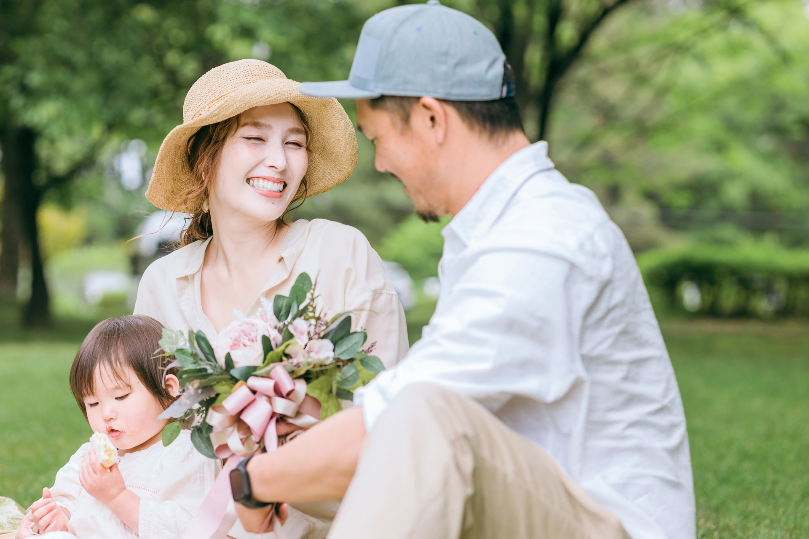

こんにちは。豆太郎です。
今回は、以前書いた孤独にならないための対策記事の第2段目となります。この記事では、感謝と孤独感について紹介します。

仏教の言葉に「[報恩感謝](https://www.tokkouin.com/2024/01/01/%E5%B9%B4%E9%A0%AD%E6%89%80%E6%84%9F-%E5%A0%B1%E6%81%A9%E6%84%9F%E8%AC%9D%E3%81%AB%E5%BF%97%E3%81%99/#:~:text=%E6%B3%95%E3%83%BB%E5%83%A7%EF%BC%89%E3%81%AB%E5%AF%BE%E3%81%97-,%E5%A0%B1%E6%81%A9%E6%84%9F%E8%AC%9D,-%E3%81%99%E3%82%8B%E3%81%93%E3%81%A8%E3%81%A7%E3%81%99)」という感謝を表す言葉があります。

「報恩感謝」とは、自分を生んでくれた祖先や、支えてくれる友人、先生または国を支えてくれる総理大臣など、私たちの生活ではありとあらゆる人に支えられて生活をしていることを感じ、感謝することです。「報恩感謝」をすることによって、日々を平穏に過ごすことができると、仏教を開いたブッタによって伝えられています。

**ブッタの言うとおりに、実際の研究では日々感謝する人は、孤独感が少ないことが分かっています。**

そこで今回は、感謝と孤独感について紹介していきます。

## 感謝の気持ちを抱きやすい人は孤独になりにくい

[26件の記事や論文を元に行われた孤独感と感謝の関係についてのメタ分析](https://iaap-journals.onlinelibrary.wiley.com/doi/10.1111/aphw.12549)では、以下のようなことが分かりました。

- **感謝の気持ちが平均以上の人は、孤独のスコアが平均以下になる可能性は62％である。** つまり、平均以上の感謝の気持ちを持つ人は、感謝の気持ちが平均以下の人と比べると、24％ほど孤独になりにくいと考えられる。

- **感謝と孤独には中程度の逆相関(r=-0.406)があった。つまり、感謝の気持ちが高い人は、孤独になりにくい傾向があると言える。**

上記の事からも、感謝の気持ちを日頃から高く持っている人ほど、孤独になりにくいことが分かります。

## 感謝の気持ちを表出するためのトレーニングで、孤独感が減る

[2020年に筑波大学の酒井先生によって行われた研究](https://www.jstage.jst.go.jp/article/jjep/68/2/68_111/_pdf)では以下の２つの調査を行いました。

1. 学生に対してアンケートに答えてもらい、感謝表出スキルと孤独感、または他人からのサポートをどれだけ感じているかを調べた。ここで、感謝表出スキルとは、相手から何か親切をされたときに、感謝の気持ちを伝えているかどうかの尺度となります。

2. 感謝表出スキルを高めるための訓練(対面トレーニング、感謝することのメリットを教える等)を５週間ほど被験者に対して行うことで、孤独感の減少や他人からのサポートを受けている感覚の増加につながるかどうかを調べた。

その結果が以下のようになっています。

- **感謝表出スキルが高いほど、孤独が減少することが分かった。** 具体的には、感謝スキルの得点が平均(50％)から、全体の上位16％に上がると孤独感のスコアが平均(50％)から、全体の下位30％に下がり、孤独感が減る。

- また、感謝表出スキルが高いほど、周りからサポートを受けていると感じる、もしくは周りからのサポートをより受けていることが分かった。

- **また、感謝表出スキルの高まり、周りからのサポートをより受けられることによって、さらに孤独感が下がる。具体的には、周りからのサポートが増えることで孤独感が減ることを考慮すると、感謝表出スキルが平均から全体の上位16％に上がると、周りからのサポートが増え、孤独感が全体の下位24％まで下がる。**

- **感謝表出スキルのトレーニングを５週間にわたって行ったところ、感謝表出スキルが向上して、孤独感が減少することが分かった。具体的には、感謝表出トレーニングを行うことで、感謝スキルのスコアが平均から全体の上位20％に上昇した。また、トレーニングにより感謝スキルの上昇度合いが上位16％ほど高まった人は、孤独感が平均から下位20％に減少した。** このことから、感謝表出トレーニングで感謝スキルが高まり、孤独感が減少することが確認された。

上記の事から**感情表出スキル（相手から何か親切をされたときに、感謝の気持ちを伝えているかどうか）が孤独感に有意に影響を及ぼす**ことが分かりました。 感情表出スキルが高い人は、周りの人からもサポートを受けやすく、それによってさらに孤独感が減少しているとのこと。

また、感情表出のトレーニング（感謝のメリットについて学ぶ、感謝の表現方法）を行うことで、感情表出のスキルを高めることができ、孤独感が減少されることが分かりました。

ですので、孤独感を解消するためにも

- 感謝のメリットを知る（感謝をすることによる健康的・人間関係のメリットを知る）
- 感謝の適切な表現方法を知る（[理由をつけて、感謝を伝える](https://oggi.jp/6782141#:~:text=2%EF%BC%9A-,%E7%90%86%E7%94%B1%E3%82%82%E6%B7%BB%E3%81%88%E3%81%A6%E3%80%8C%E6%84%9F%E8%AC%9D%E3%81%AE%E6%B0%97%E6%8C%81%E3%81%A1%E3%80%8D%E3%82%92%E4%BC%9D%E3%81%88%E3%82%8B,-%E3%80%8C%E3%81%82%E3%82%8A%E3%81%8C%E3%81%A8%E3%81%86%E3%80%8D%E3%81%A8%E3%81%84%E3%81%86%E8%A8%80%E8%91%89)といいらしいです。）

といったことを心掛けると良いと思います。

## 感謝表出スキルの得点を知る

以下は、先ほど紹介した筑波大学の酒井先生の研究で用いられていた感謝表出スキルを採点する質問です。

自分がどれだけ、感謝表出できているのかを確かめましょう。

以下の文に対する自分の感情や行動を評価してください。

評価は（₁：まったく実行していない，₂：ほとんど実行していない，₃： 実行していない，₄：あまり実行していない，₅：ときどき実行し ている，₆：実行している，₇：だいたい実行している，₈：いつ も実行している）のスケールで採点してください。

1. 私は，お礼として相手を手助けする。

2. 私は，お礼として相手に親切にする。

3. 私は，相手に微笑みながら，感謝の気持ちを伝えている。

4. 私は，相手の目を見ながら，感謝の気持ちを伝えている。
5. 私は，お礼として相手に協力する

6. 私は，相手に「ありがとう（ございます）」と言って，感謝の気持ちを素直に伝えている。
7. 私は，相手にジェスチャー（身振り手振り）を使って，感謝の気持ちを伝えている。

8. 私は，お礼として相手にプレゼントをあげる。

9. 私は，お礼として相手に食べ物をあげる。

10. 私は，相手に「ありがとう（ございます）」という以外の言葉で，感謝の気持ちを伝えている。

上記の、感謝表出スキルを採点して、一問に対する平均点を求めてください。

ちなみに、[筑波大学の酒井先生の研究の被験者全員の感謝表出スキルの平均点は](https://www.jstage.jst.go.jp/article/jjep/68/2/68_111/_pdf)、平均点が5.63点で、標準偏差は1.00でした。
私は、4.8点で、平均点よりも低かったです（おそらく、下位20％くらいです）。

とくに、親切にされた相手に食べ物をあげる、プレゼントをあげるあたりができていなかったです。ですので、今度、家族や友人にでもプレゼントを上げようと思います。

また、身振り手振り使って感謝を表現することもできていませんでした。ですので、今度から、大学の授業でお世話になっている先生や、サークルの運営・手伝いをしているメンバーに深くお辞儀する、胸に手を当ててお辞儀する、といったことを心掛けると良いかなと思いました（笑）。

## 感謝することと孤独感のまとめ

上記に紹介した感謝と孤独感の研究を以下にまとめました。

- 感謝と孤独には中程度の逆相関(r=-0.406)があった。
- 感謝表出スキルが高いほど、孤独が減少することが分かった。
- また、感謝表出スキルが高いほど、周りからサポートを受けていると感じる、もしくは周りからのサポートをより受けていることが分かった。

- そして、感謝表出スキルの高まり、周りからのサポートをより受けられることによって、さらに孤独感が下がる。

上記の事から、**感謝することで孤独が減少することが分かりました。**

**孤独になると死亡率や認知症・うつ病のリスクが高まることを考えると、感謝することは誰にでもできる簡単な孤独対策と言えるかなと思います。**

ですので、仏教の言葉にもあるように、「報恩感謝」を意識して、日々周りの人に感謝を感じながら生活することを大事にしていきましょう！

以上、アンチエイジングの研究を紹介しました。
みなさん、ぜひ健康に気をつけて長く生きましょう！では、また来週にお会いしましょう！

  {{ $data.Title }}>

